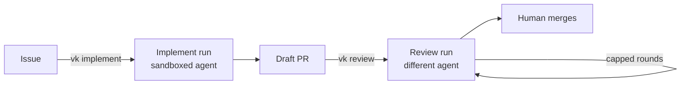

# Contributing

## What this is

Vishwakarma is a code factory. It turns a GitHub issue into a reviewed draft pull request
by running coding agents inside sandboxes, built on the Flue framework. GitHub labels are
the state machine and a GitHub Projects board is the view of it. It is built for one
operator first, and made configurable for other people only once its own workflow is
boring.

Vishwakarma is its own first customer. It runs against this repository, so an issue or a
pull request here is work the factory can pick up.

## Status

The project is at v0. `apps/cli` holds the `vk` CLI, and `vk setup` is its one built
command. The rest of `apps/` and `packages/` is Vite+ monorepo starter code, not
Vishwakarma. The project context and the decisions come first, then the code.

Deliberately unbuilt. Each gap has a reason, and the reason lives in `/project-context`:

- No webhook listener.
- No GitHub App.
- No plugin or module loader.
- No web client.
- No remote sandbox.

## Conventions

Every rule about the code lives in `/project-context`. Invoke it.

## How to contribute

- Commands: see the `scripts` block in `package.json`.
- Commits: use the `/git-commit` skill.
- Pull requests: open as a draft with the `/create-pr` skill.
