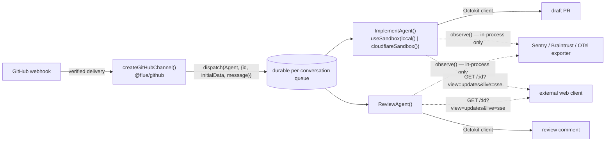

# Flue framework — research for Vishwakarma

Date: 2026-09-16. Method: every sidebar page (Introduction, Guides, Advanced) fetched live via WebFetch against https://flueframework.com, plus four supporting pages needed to answer specific Vishwakarma questions that the sidebar pages only partially resolved (`guide/cloudflare-target/`, `reference/sandbox-api/`, `reference/events/`, `reference/streaming-protocol/`, and the ecosystem GitHub channel page `ecosystem/channels/github/`). Quoted text is verbatim from the fetched pages. Anything not directly confirmed on a fetched page is marked **unverified**.



## Introduction

### Why Flue?

Marketing/overview page, no concrete API surface. Tagline: "the open agent framework, from the creators of Astro" — build agents in TypeScript, deploy to Node.js, Cloudflare, or CI/CD. Named feature list: Agents, Sandboxes, Subagents, Skills, Tools, MCP Servers, Persistent State, Chat. Design principles (paraphrased headings, not exact sentences): Harness-first ("the agent framework is the primary artifact"), Dynamic ("programs written as functions with hooks," not static config), Durable (built-in session logging, automatic recovery), Open (model/sandbox/deployment flexibility, no vendor lock-in), Built to scale.

**Vishwakarma implications:** the "Dynamic … functions with hooks" principle is a working precedent for exactly the kind of composition model Vishwakarma wants (Nuxt-inspired plugin/module/hook/event), though see Agent Hooks below — Flue's actual mechanism is function composition, not a plugin registry.

Source: https://flueframework.com/docs/guide/why-flue/

### Getting Started

Scaffolds and runs a first agent locally, then deploys it.

**API surface:**

- Prerequisite: Node.js `>=22.19.0`.
- Install: `npm install @flue/runtime @flue/cli`.
- `flue.config.ts`: `export default defineConfig({ target: 'node' })` (or `'cloudflare'`).
- Agent file convention: `src/agents/assistant.ts`, `'use agent'` directive, capitalized exported function, e.g. `Assistant()`.
- `useModel()` hook — "customize and modify your agent abilities."
- Router file `src/app.ts` (Hono app); `createAgentRouter()` mounts agent routes.
- Build tooling: `@flue/vite`, `hono`, `vite`; optional `@cloudflare/vite-plugin`.
- CLI: `npx flue run src/agents/assistant.ts --message "text"` (`--id` flag for addressing/persistence); `npx vite dev` (port 5173); `vite build`.
- `.env` for provider keys (e.g. `ANTHROPIC_API_KEY`).
- Deploy targets: Node.js (`dist/server.mjs`), Cloudflare Workers, CI/CD.

**Vishwakarma implications:** `target: 'node' | 'cloudflare'` in config is a top-level _deploy-target_ choice in Flue, not a per-run sandbox choice — a real design difference from Vishwakarma's requirement, where local-vs-remote sandbox is a **per-job** decision, not per-deployment. No mention of custom sandbox images or mounting host dotfiles on this page.

Source: https://flueframework.com/docs/guide/getting-started/

### Migration Guide

Breaking-change guide from v1 (`1.0.0-beta.9`) to v2.0.0 — the densest of the three intro pages, and effectively documents the _current_ v2 API surface by contrasting old vs new.

**API surface (verbatim/exact identifiers):**

- Build: Vite + `@flue/vite` replaces the old CLI build/dev; config imports from `@flue/runtime/config`.
- Routing: explicit `app.ts` + `createAgentRouter(agent)`; agents found via `'use agent'` directive scan, not file-path mounting.
- Agent definition: exported capitalized function using hooks; config becomes statics, e.g. `agent.durability = { maxAttempts: 5 }`.
- Hooks: `useModel()`, `useTool()`, `useSkill()`, `useSubagent({ name, description, agent, model?, thinkingLevel? })`, `useSandbox(factory, { cwd })`, `useInstruction()`, `useInitialData()`, `usePersistentState()`, `useDelivery()`, `useDispatchMessage()`, `useDataWriter()`, `useAgentStart()`, `useAgentFinish()`, `useResponseStart()`, `useResponseFinish()`.
- **Workflows removed entirely** in v2. Replacements: single-shot `init(agent, { id })` → `dispatch()` / `read(receipt)`; checkpointed sequences via `durable: true` tools with `step.do(name, fn)`; anything bigger is application-owned (Cloudflare Workflows recommended, not built in).
- Tool contract: `run()` returns `{ output?, terminate? }`; `run({ data })` (renamed from `input`); new flags `harness: true` and `durable: true`; `harness.sandbox` exposes `readFile`/`writeFile`/`exec`, `harness.prompt(text, options?)`.
- Dispatch: pass the agent function directly; `initialData` is schema-validated; `uid` semantics — omit = continue-or-create, prior receipt `uid` = continue, `uid: null` = create-only; receipt field renamed `dispatchId` → `submissionId`.
- Database adapters take a driver object, not a connection string — e.g. `postgres({ query, transaction, close })`; config moved `.flue/db.ts` → `src/db.ts`.
- Channels mounted explicitly via `app.route()`; `conversationKey()` → `instanceId()`, `parseConversationKey()` → `parseInstanceId()`; structured facts go through `initialData`.
- Providers: `registerProvider()` → `createProvider()` + `setProvider()`; auth via `auth.apiKey.resolve()`; `cloudflareBindingProvider({ binding, gateway })`.
- Observability: `run_start`/`run_end` → `agent_start`/`agent_end`; `runId` → `instanceId` + `submissionId`; new terminal event `submission_settled`; OpenTelemetry via `createOpenTelemetryInstrumentation()` + `instrument()`.
- React SDK: only `useFlueAgent` remains; `createFlueClient({ url })` → `send()`, `wait()`, `observe()`, `history()`, `abort()`, `attachmentUrl()`.
- CLI: `flue run src/agents/support.ts --message "..." --id ticket-42`; flags `--data`, `--uid`/`--new`, `--json`; removed `--server`, `--header`, `--target`, `--root`, `--output`, `--config`.
- Cloudflare specifics: `FlueRegistry` class removed; per-agent generated DO classes (e.g. `Triage()` → `FlueTriageAgent`); binding format `FLUE_<AGENTNAME>_AGENT`; `.flue/cloudflare.ts` → `src/cloudflare.ts`; minimum `compatibility_date` `2026-04-01`; `run_worker_first` mounts `["/api/*", "/agents/*", "/channels/*"]`.
- Skills: `SKILL.md` imports resolve to a `SkillReference` for `useSkill()`; other `.md` imports are plain strings, wrap with `defineSkill({ name, description, instructions })`.
- Sandboxes: **"No implicit environment"** — an agent without `useSandbox()` has no filesystem. Example: `useSandbox(bash(() => new Bash({ fs: new InMemoryFs() })))`. Remote sandbox providers should be created lazily inside the factory's `createSandbox(options)`, not at module top level; `options.id` "carries conversation id for durable per-conversation workspaces."
- Persisted-state schema v5 (beta) → v8 (v2) is a **reset-only migration**: "existing databases rejected before code runs; no in-place migration."
- File/folder conventions: `app.ts` required; `src/agents/` no longer special (agents found anywhere via directive scan); `src/db.ts`, `src/cloudflare.ts`; gitignore `.flue-vite/` and `.flue-vite.wrangler.jsonc`; `vite.config.ts`'s `flue()` plugin must precede `cloudflare()`.

**Vishwakarma implications:** this page is the single most load-bearing intro page. The `use*()` hook family is a concrete, shipped example of the "functions with hooks" composition style Vishwakarma wants to emulate for its own plugin/module/hook/event model. The removal of Flue's general-purpose Workflows system in v2 — replaced by three narrower primitives — is a real design signal worth weighing before Vishwakarma builds a heavy durability layer for its own N-round review loop. Custom sandbox images and mounting host dotfiles (`~/.claude/CLAUDE.md`, `~/.codex/AGENTS.md`) are **not mentioned anywhere in this page** — unverified/likely out of Flue's scope; see Sandboxes section below for the definitive answer.

Source: https://flueframework.com/docs/guide/migration/

## Guides

### Project Layout

Flue's file/folder convention and source-root resolution.

**API surface:**

- Source-dir resolution order (first match wins, exclusive — **not merged**): `.flue/` (self-contained area inside a larger app) → `src/` (recommended for new projects) → project root (compact layout for small projects). Verbatim: "Flue does not merge layouts: when `.flue/` exists, `app.ts`, `db.ts`, `cloudflare.ts`, and the `'use agent'` scan are resolved from it, not from `src/` or the project root."
- Top-level files: `flue.config.ts` (optional), `vite.config.ts` (optional), `src/app.ts` (**required**), `src/db.ts` (optional), `src/cloudflare.ts` (optional). `dist/` is the default `vite build` output directory.
- Single-agent layout: `skills/`, `tools/`, `subagents/`, `channels/` folders alongside `agent.ts`.
- Multi-agent layout: each agent nested under `src/agents/<name>/` (own `skills/`, `tools/`, `subagents/`, `channels/`, `agent.ts`), plus a shared `shared/` folder.

**Vishwakarma implications:** the `flue.config.ts` + `vite.config.ts` + optional `db.ts` + optional `cloudflare.ts` split is a real precedent for a layered, config-driven convention Vishwakarma could mirror for its own headless server plus a distinct Cloudflare-sandbox entrypoint. The per-agent `channels/` folder is the conventional home for inbound/outbound integration code — directly analogous to where a GitHub-label webhook listener would live under a similar layout.

Source: https://flueframework.com/docs/guide/project-layout/

### Agents

Core primitive: an agent is a plain function returning the system prompt, composed via hook calls, invocable through several transports.

**API surface:**

- "An agent function represents an agent in Flue... a JavaScript function that returns the agent's `system` prompt instructions." "An agent is made up of three key parts, all working together: LLM, harness, and specialized context."
- `'use agent'` directive at the top of the file, before imports; capitalized exported function, e.g.:
  ```ts
  "use agent";
  import { useModel } from "@flue/runtime";
  export function TriageAgent() {
    useModel("anthropic/claude-sonnet-4-6");
    return "Investigate the reported issue and recommend the next action.";
  }
  ```
- `dispatch(AgentFunction, { id, message })` — routes async events (webhooks/queue messages), returns a receipt.
- `init(Agent, { id: 'identifier' })` — initializes an agent instance with a given identity.
- `start({ agents: [...], db: adapter })` — boots the runtime standalone (Node scripts/cron).
- CLI: `flue run src/agents/triage-agent.ts --id issue-17307 --message "text"`.
- HTTP: `POST /agents/support-assistant/ticket-8472` → `202` (async).
- Identity pinning: `TriageAgent.agentName = 'triage-agent'` — "To rename the function without a database migration, pin the identity with the `agentName` static."
- "Channels" named as the concept for "verified provider ingress and application-owned outbound behavior," shown via a webhook-verification example that then calls `dispatch()`.

**Vishwakarma implications:** this is the closest Flue analog to "applying a GitHub label triggers a sandboxed agent." A GitHub-label listener maps naturally onto: verify webhook → `dispatch(ImplementAgent, { id: <issue/PR id>, message })`, mirroring Flue's own recommended pattern. `agentName` decoupling function identity from stored conversation identity is directly relevant if Vishwakarma ever renames its implement/review handlers without breaking in-flight sandboxes.

Source: https://flueframework.com/docs/guide/building-agents/

### Agent Hooks

Composable `use`-prefixed functions called inside an agent function's body; each grants one capability.

**API surface:**

- "A hook is a plain function that you call inside your agent function's body to give your agent one new capability." All hook names start with `use`.
- Rules of hooks: "the agent function _re-renders_ on every model call and re-runs its hooks. Unlike React, resource hooks can be added and removed conditionally." Changing the tool set "can invalidate the provider's prompt cache." Event hooks may also be declared conditionally.
- Custom-hook composition pattern (not a plugin registry):
  ```ts
  function useEscalation() {
    useTool(escalateCase);
    return "Escalate to a specialist only after...";
  }
  ```
  "Custom hooks are how larger agents stay readable, and how capabilities get shared across agents."
- Full inventory named on this page: `useModel`, `useSandbox`, `useTool`, `useMcpConnection`, `useSkill`, `useSubagent`, `usePersistentState`, `useAgentStart`, `useAgentFinish`, `useResponseStart`, `useResponseFinish`, `useDataWriter`, `useInitialData()`.
- Lifecycle semantics: `useAgentStart()` runs "every time a message is delivered to the agent" (async); `useResponseStart()`/`useResponseFinish()` run "exactly once" at each response's true start/end; their return values merge onto the response's `metadata`.
- `usePersistentState(key, initial)`: "the value is durable: every write is recorded in the conversation's storage, and every render reads the latest value back — across turns, across restarts, for the life of the conversation." Prefer the updater-function form over deriving from the render value.
- Event-hook durability: "Their callbacks run at-least-once: completed work commits durably and is never repeated, while interrupted work is retried."
- Full definitions for every built-in hook live on the Agent API reference page (`docs/reference/agent-api/`) — not fetched in this pass.

**Vishwakarma implications:** the "at-least-once, completed work never repeated, interrupted work retried" contract on lifecycle hooks is exactly the guarantee an N-round review loop needs. The explicit non-plugin stance — extension via plain function composition, not a separate module/plugin registry — is worth flagging as a **deliberate contrast** to Vishwakarma's stated Nuxt-inspired plugin/module system; decide explicitly which model to adopt rather than assuming they're equivalent.

Source: https://flueframework.com/docs/guide/agent-hooks/

### Models

Declaring/tuning an agent's LLM.

**API surface:**

- `useModel(modelSpecifier: string, options?: { thinkingLevel?, compaction? })` — specifier is `'provider-id/model-id'`, e.g. `useModel('anthropic/claude-opus-4-6', { thinkingLevel: 'high', compaction: { keepRecentTokens: 16000 } })`.
- `ThinkingLevel`: `'off' | 'minimal' | 'low' | 'medium' | 'high' | 'xhigh' | 'max'` (default `'medium'`).
- `CompactionConfig`: `reserveTokens` (default model-aware, ≤20000), `keepRecentTokens` (default 8000), `model` (cheaper summarizer model); `compaction: false` disables threshold triggering but keeps overflow recovery.
- Mid-conversation switching is state-driven, not live — gate `useModel()` on `usePersistentState()`. "The model, thinking level, and compaction settings are **submission-scoped**: the runtime reads them once, when the agent wakes to process an accepted input" — a switch applies on the _next_ submission, not mid-run.
- Credentials: `.env` locally (`ANTHROPIC_API_KEY`, `OPENAI_API_KEY`, `GEMINI_API_KEY`, auto-loaded by `flue run`/`vite dev`); Node deploy uses process env; Cloudflare uses Worker secrets (`npx wrangler secret put ANTHROPIC_API_KEY`).
- `setProvider(provider)` — module-top-level registration in `app.ts`, keyed by provider `id` (replaces prior registration for that id).
- `createProvider({ id, auth: { apiKey: { name, resolve } }, models: [...], api })` (from the underlying "Pi" library); each model definition needs `id`, `name`, `api`, `baseUrl`, `reasoning`, `input`, `cost`, `contextWindow`, `maxTokens`.
- `cloudflareBindingProvider({ binding: env.AI, gateway: { id, cacheTtl } })` from `@flue/runtime/cloudflare/workers-ai` — routes `cloudflare/...` calls through Cloudflare AI Gateway by default (caching/logging/budget controls); `gateway: false` opts out.
- Self-hosted/custom example (Ollama, keyless, OpenAI-compatible): `createProvider(...)` with `openAICompletionsApi()`. "Any OpenAI- or Anthropic-compatible endpoint works."

**Vishwakarma implications:** the submission-scoped read (settings lock in per-submission, not mid-turn) is a real fence if Vishwakarma wants to escalate models mid-review-round based on a label decision — the switch takes effect on the _next_ dispatch. `cloudflareBindingProvider()`'s default AI Gateway routing is a ready-made caching/logging/budget pattern relevant to Vishwakarma's Cloudflare-remote sandbox target.

Source: https://flueframework.com/docs/guide/models/

### Tools

A tool is "a function you write, described to the model, that the model may call while it works — look up an order, file a ticket, issue a refund."

**API surface:**

- `defineTool(...)` validates/returns a frozen tool definition; `useTool(...)` mounts it.
- Config fields: `name`, `description`, `input` (Valibot schema), `output` (Valibot schema), `run`, `harness: true`, `durable: true`.
- `run` params: `data`, `signal`, `log`, `toolCallId`, plus `harness` (if `harness: true`) and `step` (if `durable: true`).
- Built-in sandbox tools: `read`, `write`, `edit`, `bash`, `grep`, `glob`.
- `harness.sandbox` exposes `readFile`/`writeFile`/`exec`; `harness.prompt(text, options?)` for in-tool model calls.
- Durable pattern: "every side effect goes through `step.do(name, fn)`." Verbatim: "Everything effectful goes in a step. Code between steps re-executes on recovery, so keep it cheap and effect-free."
- Conditional mounting: wrap `useTool` in a condition gated on `usePersistentState()` — "the tool exists only in the renders where the condition holds."
- `useDelivery()` — carry verified identifiers instead of trusting model-supplied values.

**Vishwakarma implications:** `harness.sandbox.{readFile,writeFile,exec}` is a minimal reference shape for a sandbox-execution interface. `step.do(name, fn)` is a direct precedent for the crash-recovery/resumption Vishwakarma needs for implement/review loops. `useDelivery()`'s point — verify identifiers server-side, don't trust model output — maps onto Vishwakarma's GitHub webhook trust boundary.

Source: https://flueframework.com/docs/guide/tools/

### MCP

"MCP (Model Context Protocol) is an open standard for connecting AI agents to external services" — agents connect to MCP servers instead of hand-writing a tool per service.

**API surface:**

- `useMcpConnection()` hook; `defineMcpConnection(...)`; `createMcpConnection(definition)` (lower-level).
- Types: `ToolDefinition`, `McpConnectionDefinition`.
- Config: `name` (server id), `url`, `auth` (string or function, Bearer token), `tools` (allowlist array), `optional` (bool — proceed without the server if unreachable).
- Naming convention: MCP-sourced tools are named `mcp__<server>__<tool>` (example: `mcp__linear__create_issue`).
- Verbatim: "Flue never stores or manages your tokens. It is your responsibility to own any OAuth flow, token storage, and refresh token logic."

**Vishwakarma implications:** the credential-ownership fence is a security-scope decision Vishwakarma must make explicitly for its own GitHub App/PAT and any MCP servers wired into sandboxes. `mcp__<server>__<tool>` namespacing is a reasonable precedent for tool naming across Vishwakarma's own plugin/module composition.

Source: https://flueframework.com/docs/guide/mcp/

### Skills

"A skill packages reusable expertise — instructions written in markdown, optionally with supporting files — that an agent loads only when it needs it," following "the open Agent Skills format," progressively disclosed.

**API surface:**

- `useSkill(...)` mounts a skill reference; `defineSkill(...)` declares one in code (`name`, `description`, `instructions`, optional `files` map).
- Types: `SkillReference` (result of a `SKILL.md` import), `SkillDefinition`.
- File convention: `SKILL.md` required, frontmatter (`name`, `description`, `license`, `compatibility`, `metadata`, `allowed-tools`) + markdown instructions body. Directory name must match `name`.
- Workspace skill path: `.agents/skills/<name>/SKILL.md`. Verbatim: "At session start, the runtime scans `.agents/skills/` in the sandbox's working directory, and every valid `<name>/SKILL.md` it finds joins the catalog."
- Frontmatter constraints (verbatim): `name` — "lowercase letters, numbers, and hyphens; no leading, trailing, or consecutive hyphens; at most 64 characters"; `description` — "non-empty, at most 1024 characters."
- Runtime tool for reading packaged files: `read_skill_resource`.
- Packaged vs. workspace split: "A packaged skill's supporting files travel inside your application bundle, not the agent's workspace."
- Security: packaging "refuses to package secrets — `.env` files, private keys, credential stores, and symbolic links are hard errors."
- Skill activation preserves the cached system-prompt prefix: "the system prompt never changes when a skill activates, and the provider's cached prompt prefix survives."
- Skill imports "must be **static**" (per Migration Guide).

**Vishwakarma implications:** direct, positive precedent for the repo-local `/review-pr` skill design — Flue auto-discovers `.agents/skills/*/SKILL.md` from the sandbox's working directory, confirming that a checked-out repo's own skills load without extra wiring, and that this convention matches Claude Code / Codex's own `SKILL.md` format (a real cross-tool standard). The hard-error-on-secrets rule when packaging skills is worth copying as-is for Vishwakarma's own file-mounting into a sandbox (e.g. never silently bundle `.env`/credentials alongside `~/.claude/CLAUDE.md`).

Source: https://flueframework.com/docs/guide/skills/

### Subagents

A subagent is "a named delegate an agent can hand a focused task to" that "works in its own fresh context, with its own instructions and capabilities, and only its final answer returns to the parent's conversation."

**API surface:**

- `useSubagent()` hook; `defineSubagent()` typing helper; `GeneralSubagent` built-in blank delegate, mounted as `flue-general`.
- Fields: `name` (required), `description` (required, drives model routing), `agent` (required, function returning instructions), `model` (optional override), `thinkingLevel` (optional override), `cwd` (optional).
- Task-tool call params: `agent`, `cwd`, attachment-id forwarding for images.
- Sandbox/environment inheritance (verbatim): "Delegates inherit the parent's environment: the sandbox and its harness tools (read, write, bash, …); workspace context discovered from the working directory."
- Durability (verbatim): "Child sessions write their own durable records, so a task interrupted by a crash or redeploy resumes where it left off."
- Parallelism (verbatim): "Tool calls in one batch execute in parallel, so the model can launch several tasks at once — five independent checks become five concurrent child sessions, each with its own context window."
- Depth cap (verbatim): "The runtime caps delegation depth at four levels."

**Vishwakarma implications:** subagents share the _parent's_ sandbox by default — a point of deliberate divergence to design around if Vishwakarma wants separate sandboxes per triggered agent. Fresh-context isolation (child doesn't see the parent's conversation) structurally enforces "the agent that wrote it never verifies it." **Unverified in this pass** (carried from an earlier read, not independently re-confirmed against the live page this session): `useSandbox`/`usePersistentState`/`useModel` reportedly throw when called inside a subagent delegate — treat as plausible but unconfirmed.

Source: https://flueframework.com/docs/guide/subagents/

### Sandboxes

"A **sandbox** is an execution environment you attach to an agent: a filesystem and shell where it reads, writes, and runs commands."

**API surface:**

- `useSandbox(factory, options?)` — core hook.
- Factories: `bash(...)` (virtual, in-memory, `just-bash`-backed), `local({ cwd?, env? })` (binds the Node host filesystem), custom adapters installed via `flue add sandbox <provider>`.
- `local({ env: { GH_TOKEN: process.env.GH_TOKEN } })` — env vars are explicit, opt-in per key.
- Virtual sandbox example: `new Bash({ fs: new InMemoryFs({ '/data/catalog.csv': ... }), network: { allowedUrlPrefixes: ['https://api.example.com/'] } })`.
- `<cwd>/.agents/skills/*/SKILL.md` auto-discovered as workspace skills; `AGENTS.md` at `cwd` is included in the system prompt when present.
- `harness.sandbox.writeFile('document.md', data.document)` — the harness tool for writing into a running sandbox.

**Constraints (verbatim):**

- `local()` env allowlist: "Only a short allowlist of shell essentials passes through by default — `PATH`, `HOME`, `USER`, `LANG`, `TERM`, `TMPDIR`, and the like — and never API keys..."
- `local()` isolation: "no isolation, by design" — a real host filesystem/process binding, "only for trusted environments."
- Remote-sandbox durability is opt-in, not automatic: "`createSandbox({ id })` receives the agent instance id. A factory that looks up an existing provider sandbox by that id before creating one gives each conversation a durable workspace..." — durability is something _you_ implement in the factory (key lookups by `id`), Flue doesn't guarantee it.
- Virtual sandbox is explicitly ephemeral: "The filesystem starts empty and is rebuilt fresh each time the runtime initializes the agent for new work. Files written while processing one message are gone by the next."
- Cancellation: "most provider SDKs have no mid-flight cancellation... most providers keep running commands in background after rejection."

**Vishwakarma implications:** `local()` is dev/CI-grade only, not a substitute for Vishwakarma's own untrusted-code isolation. The "key by `id`, look up before create" pattern is exactly what a per-issue/per-PR durable review-round workspace needs. No custom-image mechanism appears on this page — see Cloudflare target and Sandbox Adapter API below for the definitive answer.

Source: https://flueframework.com/docs/guide/sandboxes/

#### Cloudflare target (incl. Cloudflare Sandbox)

Fetched via the Sandboxes page's own "Next Steps" link, because it directly answers Vishwakarma's custom-image question.

**API surface:**

```ts
"use agent";
import { getSandbox } from "@cloudflare/sandbox";
import { env } from "cloudflare:workers";
import { type AgentProps, useModel, useSandbox } from "@flue/runtime";
import { cloudflareSandbox } from "@flue/runtime/cloudflare";

export function Assistant({ id }: AgentProps) {
  useModel("anthropic/claude-sonnet-4-6");
  useSandbox(cloudflareSandbox(getSandbox(env.Sandbox, id)), { cwd: "/workspace" });
}
```

- `getSandbox(env.Sandbox, id)` — from `@cloudflare/sandbox` (Cloudflare's own package), returns the sandbox Durable Object RPC stub keyed by agent instance id.
- `cloudflareSandbox(...)` — from `@flue/runtime/cloudflare`, wraps that stub into a Flue `SandboxFactory`.
- Each Cloudflare agent = its own Durable Object.

**Custom image — key finding (verbatim):** "Export the sandbox Durable Object class from `cloudflare.ts`, declare its binding and **container image in `wrangler.jsonc`**, then wrap the RPC stub returned by `getSandbox(...)`." Custom-image configuration is **not a Flue API concern at all** — it's pushed entirely to Cloudflare's own container/Durable Object config in `wrangler.jsonc`, outside Flue's abstraction. The page defers to Cloudflare's own docs for Dockerfile/image syntax — that detail is **unverified** here.

- Files/env into the Cloudflare sandbox: only `cwd: '/workspace'` appears as a `useSandbox` option in the shown example; no explicit env-injection or file-mounting mechanism is shown for the Cloudflare adapter specifically (see the generic `Sandbox` interface below — likely `exec(cmd, { env })`, but not confirmed for this adapter).

Source: https://flueframework.com/docs/guide/cloudflare-target/

#### Sandbox Adapter API (reference)

Fetched as a necessary follow-up — this is where a custom-image or bulk-file-mount contract would live if Flue had one.

**API surface:**

- From `@flue/runtime`: `SandboxFactory`, `Sandbox`, `SandboxDriver` (interfaces), `SandboxToolFactory` (type), `sandboxFromDriver()`, `bash()`, `createReadTool`/`createWriteTool`/`createEditTool`/`createBashTool`/`createGrepTool`/`createGlobTool`, `SandboxOperationUnsupportedError`, `BashLike`.
- From `@flue/runtime/node`: `local()`. From `@flue/runtime/cloudflare`: `cloudflareSandbox()`.
- Core contract:
  ```ts
  interface SandboxFactory {
    createSandbox(options: { id: string }): Promise<Sandbox>;
    tools?: SandboxToolFactory;
  }
  ```
  Verbatim, load-bearing: "No identity beyond `id`. The factory receives the instance id and nothing else — no conversation content, no request data."
- `Sandbox` interface: `exec(command, options?: { cwd?, env?, timeoutMs?, signal? })`, `readFile`, `readFileBuffer`, `writeFile`, `stat`, `readdir`, `exists`, `mkdir`, `rm`, `cwd`, `resolvePath`.
- Env vars are per-`exec`-call only (layered on the adapter's base env). `local()`'s full default allowlist (verbatim, more complete than the Sandboxes-page paraphrase): `PATH`, `HOME`, `USER`, `LOGNAME`, `HOSTNAME`, `SHELL`, `LANG`, `LC_ALL`, `LC_CTYPE`, `TZ`, `TERM`, `TMPDIR`, `TMP`, `TEMP`.
- Files: no bulk "mount a directory" primitive — files get in only via repeated `writeFile` calls. `writeFile` guarantees creating missing parent directories.
- Docker/container config: explicitly absent from this reference. Verbatim: "No mention of custom Docker images, image configuration, or container configuration exists in this document. The API describes abstract adapter interfaces, not container-specific implementation details."

**Vishwakarma implications — this directly answers the core sandbox question:** Flue's `Sandbox`/`SandboxFactory` interface has **no image/container concept at the interface level at all**. Custom images are entirely provider-specific and live outside Flue (Cloudflare: `wrangler.jsonc`). There is **no directory-mount/copy-tree primitive** — seeding `~/.claude/CLAUDE.md` / `~/.codex/AGENTS.md` into a sandbox would be one `writeFile(path, content)` call per file (host-side read, then write), written by the application, not provided by Flue. `createSandbox({ id })`'s "no identity beyond id" means any per-project image/env/file customization must be resolved _inside_ a custom factory implementation keyed on that id alone (e.g. the factory looks up project config from the id).

Source: https://flueframework.com/docs/reference/sandbox-api/

### Routing

"Agents are never mounted automatically" — every HTTP endpoint is declared explicitly in one entrypoint file.

**API surface:**

- `createAgentRouter(agent)` from `@flue/runtime/routing` — builds an HTTP sub-router for one agent.
- `Fetchable` interface — required shape for custom app entries: a `fetch(request, env, ctx)` method.
- `src/app.ts` is the single explicit route map. "There are no directory-based route conventions; mounting is purely programmatic."
- Conversation sub-routes (relative to the mount point): `POST /:id` (deliver message, `202`), `GET /:id` (snapshot/stream), `HEAD /:id` (stream metadata), `POST /:id/abort` (abort in-flight work), `GET /:id/attachments/:attachmentId` (download attachment).
- Example:
  ```ts
  import { createAgentRouter } from "@flue/runtime/routing";
  import { Hono } from "hono";
  import { Support } from "./agents/support.ts";
  import { Triage } from "./agents/triage.ts";

  const app = new Hono();
  app.route("/agents/support", createAgentRouter(Support));
  app.route("/api/assistants/triage", createAgentRouter(Triage));
  export default app;
  ```
- Dispatch-only agents (registered but never HTTP-mounted) receive messages only via server-side `dispatch()`. Verbatim: "Mounting is the exposure decision, not registration. The [`'use agent'` scan] is what makes an agent exist; the router only builds an HTTP surface over an already-registered agent."

**Vishwakarma implications:** maps cleanly onto label-triggered agents that never need a public conversation route — a GitHub webhook handler calls `dispatch(ImplementAgent, { id, message })` directly, matching Flue's own recommended "dispatch-only agent" pattern. `POST /:id` returning `202` immediately confirms the async-accept-then-stream pattern rather than holding an HTTP connection open for the whole agent run.

Source: https://flueframework.com/docs/guide/routing/

### Database

Durable conversation storage via a `db.ts` entry module wrapping a persistence adapter.

**API surface:**

- `db.ts` at the resolved source dir, default-exporting an adapter.
- Built-in: `sqlite(path)` from `@flue/runtime/node`, e.g. `sqlite('./data/flue.db')`.
- Ecosystem adapters via `flue add database <name>`: `@flue/postgres`, `@flue/libsql`, `@flue/mysql`, `@flue/mongodb`, `@flue/redis`.
- Custom adapter contract (`PersistenceAdapter` from `@flue/runtime/adapter`): `migrate()`, `connect()` (returns `{ submissionStore, conversationStreamStore, attachmentStore }`), `close()`.
- Bring-your-own-driver example: `postgres({ query, transaction, close })`.
- Without `db.ts`: in-memory SQLite; dev caches to `node_modules/.cache/flue/dev.db` or `run.db`; "production deployments lose state on restart" without an explicit adapter.
- File-backed `sqlite()` "survives process restarts on single hosts but not host loss."
- Cloudflare: "No configuration needed — Durable Object SQLite handles storage automatically."

**Vishwakarma implications:** the `submissionStore`/`conversationStreamStore`/`attachmentStore` split (durable work-tracking vs. append-only message log vs. binary attachments) is a reasonable schema to borrow for tracking "which issue/PR has which agent running, at which round." The `flue add <capability> <provider>` CLI convention (seen for both `sandbox` and `database`) is worth mirroring for a Vishwakarma module installer.

Source: https://flueframework.com/docs/guide/database/

## Advanced

### Deploy

**API surface:**

- `flue()` — Vite plugin from `@flue/vite`, discovers `flue.config.ts`. `cloudflare()` — from `@cloudflare/vite-plugin`.
- Order constraint (verbatim): "`flue()` must come **before** `cloudflare()` in the plugins array; the wrong order is diagnosed with an error."
- Commands: `vite dev`, `vite build`, `vite preview`; run via `node dist/server.mjs`.
- Build outputs: `dist/server.mjs`, `dist/app.mjs`.
- Files: `vite.config.ts`, `flue.config.ts`, `app.ts` (required), `db.ts`/`cloudflare.ts` (optional), `wrangler.jsonc`; gitignore `.flue-vite/` and `.flue-vite.wrangler.jsonc`.
- Node target (verbatim): "a self-starting server you can run anywhere Node runs: a VM, a container, or a managed host." Default port 3000, override via `PORT`.
- Cloudflare target (verbatim): "produces a Worker where each agent runs inside its own Durable Object, with durable state and global addressability out of the box."
- Constraints (verbatim): "the built server does not load `.env` — supply provider keys and other configuration when you start it." "application dependencies are externalized, not bundled." Without a `db.ts` adapter, "a restart loses" in-process-memory conversation state.
- Cloudflare manual step: you must author the `nodejs_compat` flag and Durable Object migrations yourself — "Flue never writes" these values.

**Vishwakarma implications:** Node target confirms containerized/VM self-hosting is first-class, relevant if Vishwakarma's own headless server (not the untrusted-repo sandbox) is deployed this way. No custom-image mechanism appears here either — this page is about deploying _the Flue app itself_, not about sandboxing arbitrary repos.

Source: https://flueframework.com/docs/guide/deploy/

### Workflows

A "workflow" is any script or program that drives an agent, from one-shot CLI runs to durable, checkpointed, long-running scripts.

**API surface:**

- Four driving mechanisms: `flue run` (CLI/CI), the Flue JS API (local Node), the Flue Agent SDK (HTTP to deployed agents), and Durable Workflows (hosted, checkpointed).
- `start()` — boots the runtime in-process. `init()` — returns a handle to an agent conversation. `dispatch()` — submits a message with a durable receipt, runs as its own workflow step. `read()` — awaits the settled reply. Verbatim: "`read()` holds no in-memory state: settlement and reply are durable conversation records, so any process can read a submission at any later time."
- `createFlueClient()`; `send()` sends over HTTP.
- CLI: `flue run` with `--message`, `--id`, `--new`, `--json`.
- Durable Workflows (verbatim): "a hosted script whose steps checkpoint their results, so it can retry a failed step, resume a run that spans days, and survive restarts without losing its place." "the receipt — the durable claim ticket for the submission — is checkpointed the moment it exists." "a submission that settled while the workflow was down resolves immediately" on resume.
- Named crash window (verbatim): "The one crash window left is inside the dispatch step itself: the send was admitted, but the step died before checkpointing the receipt." An unconditional retry "joins the live response at a turn boundary; both submissions settle with the same coalesced reply"; a create-only send with `uid: null` "rejects the duplicate at admission with `AgentInstanceExistsError`."
- Splitting `dispatch()` and `read()` into separate steps "splits any per-step time bound."

**Vishwakarma implications:** this is the single most relevant page for Vishwakarma's core implement→review orchestration problem. The checkpoint-the-receipt-then-await pattern, with explicit crash-window analysis (retry either coalesces or is rejected, never silently double-executes), is a directly transferable design for safely resumable label-triggered pipelines — e.g. resuming a review round after a sandbox crash without double-triggering `agent:review`.

Source: https://flueframework.com/docs/guide/workflows/

### Schedules

Cron-style delivery to agents: `croner` in-process for Node, `scheduled` Worker handler for Cloudflare.

**API surface:**

- `dispatch()` used inside the cron callback / scheduled handler; `init()`/`read()`/`start()` as in Workflows.
- `useModel()`, `useDelivery()` referenced by name (exact signatures **not confirmed verbatim** in this pass).
- Node example (verbatim code):
  ```ts
  new Cron(
    "0 9 * * *",
    {
      timezone: "America/New_York",
      protect: true,
      catch: (error) => console.error("Scheduled dispatch failed", error),
    },
    async () => {
      await dispatch(Reporter, {
        id: "daily-summary",
        message: {
          kind: "signal",
          type: "schedule",
          body: "...",
          attributes: { scheduledAt: new Date().toISOString() },
        },
      });
    },
  );
  ```
- Cloudflare example (verbatim code):
  ```ts
  export default {
    async scheduled(controller) {
      await dispatch(Reporter, {
        id: "daily-summary",
        message: {
          kind: "signal",
          type: "schedule",
          body: "...",
          attributes: {
            cron: controller.cron,
            scheduledAt: new Date(controller.scheduledTime).toISOString(),
          },
        },
      });
    },
  };
  ```

**Constraints (verbatim):**

- "Cloudflare evaluates cron expressions in **UTC**; there is no timezone option."
- "An in-process Node scheduler fires only while the server is running: fires during downtime or a deploy are skipped, and cron libraries do not replay them on restart."
- "Deliveries to one conversation never run concurrently"; "Overlapping fires against a fixed id therefore queue or coalesce."
- Cloudflare delivery guarantee: "**at-least-once**" — side effects must be idempotent.

**Vishwakarma implications:** the fixed-id, coalesce-on-overlap concurrency model is directly relevant if Vishwakarma debounces repeated label events (e.g. `agent:review` re-applied while a round is in flight) — same pattern avoids duplicate sandboxes for the same PR. Not directly about GitHub-label triggers (this page is calendar-cron), so applicability is by analogy (queueing semantics), not a literal fit.

Source: https://flueframework.com/docs/guide/schedules/

### Channels

A channel connects an external provider (Slack, GitHub, Stripe, etc.) through "verified HTTP ingress that authenticates each incoming delivery." Channels are explicitly **inbound-only**; outbound calls go through the provider's own SDK inside your app.

**API surface:**

- `create*Channel()` factory pattern (e.g. `createSlackChannel`).
- `channel.instanceId()` — derives canonical, collision-free conversation IDs for conversation-shaped providers. `parseInstanceId()` — recovers destination fields from a canonical ID.
- `channel.route()` — mountable sub-router. `createChannelRouter()` from `@flue/runtime` for custom channel routers.
- File convention: `src/channels/<provider>.ts`, mounted with `app.route('/channels/<provider>', channel.route())`.
- Dispatched events are `kind: 'signal'` messages with a namespaced `type` (e.g. `'github.issue_comment.created'`), `body`, `attributes`.
- Full channel catalog: `docs/ecosystem/#channels`.

Source: https://flueframework.com/docs/guide/channels/

#### GitHub Channel (ecosystem)

Fetched because it directly answers whether Vishwakarma should rebuild GitHub webhook ingress.

**API surface:**

- Setup: `flue add channel github` (installs `@flue/github` and `@octokit/rest`).
- `createGitHubChannel({ webhookSecret, async webhook({ delivery }) })`.
- Generated `src/channels/github.ts` exports: `channel` (webhook router/handler), `client` (Octokit instance for outbound calls), `commentOnIssue()` (example tool function).
- Mount: `app.route('/channels/github', github.route())`. Webhook URL: `https://example.com/channels/github/webhook`, `application/json` only.
- Env: `GITHUB_WEBHOOK_SECRET` (verifies inbound deliveries), `GITHUB_TOKEN` (authenticates outbound Octokit calls).
- `delivery.name` = `X-GitHub-Event`; `delivery.payload` = native `@octokit/webhooks-types` payload; `delivery.deliveryId` = delivery GUID.
- GitHub "expects a `2xx` response within ten seconds and does not auto-retry."
- The documented example only handles `issue_comment`(`created`) and `pull_request_review_comment`(`created`), but the channel itself "accepts every verified non-ping delivery" with no normalization layer — you branch on `delivery.name` (and `delivery.payload.action`) yourself for any event, including label events.
- Outbound example shown: `client.rest.issues.createComment()`.

**Vishwakarma implications — the single most load-bearing finding of this research:** Flue already ships GitHub webhook signature verification, delivery routing, and an authenticated Octokit client via `@flue/github`. **Vishwakarma should not rebuild GitHub webhook ingress from scratch if it builds on Flue.** Branching on `delivery.name === 'issues' && payload.action === 'labeled' && payload.label.name === 'agent:implement'` (and the `pull_request` equivalent for `agent:review`) is a reasonable, consistent extension of the demonstrated pattern, but is **not literally shown on the page** (only comment-webhook examples appear) — mark label-event handling as a **reasonable extrapolation, not a confirmed example**. Likewise, **no ready-made "open a draft PR" helper is shown** — only `commentOnIssue()`; opening PRs would be a hand-written `client.rest.pulls.create()` call against the same `client`.

Source: https://flueframework.com/docs/ecosystem/channels/github/

### Evals

"An automated test that runs an agent against a live model and asserts on its observable behavior: the reply it produces, the tools it calls, the data it emits" — full agent-loop testing with behavioral (not exact-match) assertions.

**API surface:**

- Config `vitest.evals.config.ts` (`include: ['src/evals/**/*.eval.ts']`, `testTimeout: 60_000`); npm script `"evals": "vitest run --config vitest.evals.config.ts"`.
- File convention: `src/evals/*.eval.ts`.
- In-process: `start({ agents: [...] })` from `@flue/runtime/node`, `init(agent)`, `agent.dispatch(message)`, `agent.read(receipt, { onEvent })` (event type `'tool-input'` carries `toolName`/`input`).
- HTTP: `createFlueClient()` from `@flue/sdk`; env `FLUE_AGENT_URL` (default `http://127.0.0.1:5173/agents/{agent-name}`); `send({ message })`, `wait(admission)`, `history()`.
- Scaffold: `flue add tooling vitest-evals`.
- Test DSL: `describeEval('suite name', { harness }, (it) => { it('case', async ({ run }) => {...}) })`.
- Judges: `FactualityJudge()`, `createJudge(...)`, threshold-based pass/fail. Helper: `toolCalls(result)`.
- Report: `evals:json` → `vitest-results.json`; `getsentry/vitest-evals` GitHub Action for publishing.

**Vishwakarma implications:** secondary relevance — useful if Vishwakarma's own agent behaviors (e.g. the `/review-pr` skill loop) are built as Flue agents and need CI-graded behavioral tests (did it call the right tool) rather than exact-text assertions.

Source: https://flueframework.com/docs/guide/evals/

### Observability

Flue emits runtime events across agent activity (model turns, tool calls, logs, token usage) via in-process subscription — a **different surface** from the durable per-conversation stream served to chat UIs.

**API surface:**

- `observe()` from `@flue/runtime` — "Registers a global subscriber for every runtime event emitted in the current process." Isolate-global, live-only, no replay/history.
- `instrument(...)` from `@flue/runtime` pairs an observer with an execution interceptor for span-producing tracing.
- `createOpenTelemetryInstrumentation()` from `@flue/opentelemetry`; `createCloudflareTracing({ content: false })` from `@flue/runtime/cloudflare`; `tracing: false` in `flue.config.ts` disables agent tracing.
- Supported integrations: Sentry, Braintrust, OpenTelemetry, Cloudflare Workers (built-in platform observability). No bundled dashboard.
- 27 documented event types (from the Events Reference): `agent_start`, `agent_end`, `idle`, `submission_queued`, `submission_running`, `submission_settled`, `submission_recovery`, `operation_start`, `operation`, `turn_start`, `turn_request`, `turn`, `turn_messages`, `message_start`, `message_end`, `text_delta`, `thinking_start`, `thinking_delta`, `thinking_end`, `toolcall_delta`, `tool_start`, `tool`, `task_start`, `task`, `compaction_start`, `compaction`, `log`.

**Key finding (verbatim):** the `observe()`/`instrument()` stream is **"isolate-scoped and live-only"** with **"no durable replay or cross-process aggregation."** It is **not queryable over HTTP by an external client** — per the Events Reference: "runtime events are separate from client-facing streams... a different surface with a different schema." Deep tracing beyond what the Streaming Protocol exposes requires wiring an OTel/Sentry/Braintrust exporter _inside the sandboxed agent process itself_.

Source: https://flueframework.com/docs/guide/observability/

#### Events Reference (supporting page)

Confirms the 27 event types above and states the in-process-only nature of `observe()`/`instrument()` explicitly, pointing to the Streaming Protocol for client-facing HTTP delivery.

Source: https://flueframework.com/docs/reference/events/

#### Streaming Protocol Reference (supporting page — answers "queryable by an external client?")

**API surface (routes relative to `/:id`):**

- `POST /:id` — deliver a message, `202`.
- `GET /:id` — snapshot (default `view=history`).
- `GET /:id?view=updates` — incremental changes; three modes: plain poll (immediate), `live=long-poll` (server holds up to 30s), `live=sse` ("Holds the connection open indefinitely and pushes chunks as server-sent events," heartbeat every 15s).
- `HEAD /:id` — stream metadata headers only. `POST /:id/abort` — cancel in-flight work. `GET /:id/attachments/:attachmentId` — download attachment bytes.
- SSE payload: `data` events (JSON chunk arrays) + `control` events. Chunk union type `ConversationStreamChunk`: `conversation-reset`, `message-appended`, `message-started`, `message-delta`, `tool-input`, `tool-output`, `tool-output-error`, `message-completed`, `submission-settled`, `data-part`, `message-metadata` — each carrying position metadata for dedup plus `conversationId`.
- `@flue/sdk` client-side: `FlueConversationSnapshot`, `ConversationStreamChunk` types; the SDK's own `observe()` method (materialized-state consumption — distinct from the runtime `observe()` above); `wait(...)`.

**Conclusion:** yes — an external client **can** get live per-job progress over plain HTTP via `GET /:id?view=updates&live=sse`, with genuinely consumable `tool-input`/`tool-output`/`message-delta` chunks, no in-process access required. This is the surface a Vishwakarma web client should target for live progress UI — not the `@flue/runtime` `observe()`/`instrument()` API, which stays server-side for tracing/telemetry export only. **Fleet-wide aggregation** (token spend, tool timings, failures across many jobs) is given by neither surface out of the box — that requires bridging `observe()` yourself (a subscriber writing to your own DB/SSE fan-out) or an OTel backend.

Source: https://flueframework.com/docs/reference/streaming-protocol/

### Durability

"Once an input is admitted, the runtime owes that conversation a durable terminal outcome — through process crashes, restarts, and redeploys." Every accepted submission reaches exactly one of: `completed`, `failed`, `aborted`.

**API surface:**

- Submissions (HTTP prompts, dispatch calls, channel deliveries, scheduled triggers) are recorded before model work begins; `202` = durable admission; submissions queue per conversation, run sequentially.
- Recovery is two-phase: **Converge** (close partial assistant output as an aborted entry) then **Classify** (determine what durable evidence proves, then continue).
- `DurabilityConfig` (agent-level static): `agent.durability = { maxAttempts: 5 /* default 10 */, timeoutMs: 7_200_000 /* default 3_600_000, i.e. 1 hour */ }` — timeout is wall-clock total from first attempt; turn-boundary joins don't extend it.
- `defineTool()` with `durable: true` creates durable tools; `step.do(name, fn)` records/replays individual steps — completed steps return recorded values on recovery without re-executing.
- `usePersistentState()` — conversation-level state surviving restarts, committed atomically with its work unit.
- `dispatch()` returns a `DispatchReceipt`; `client.wait(receipt)` / `read(receipt)` resolve settled submissions across process restarts.
- `POST /:id/abort` — records durable abort intent, settles all unsettled submissions as `aborted`.
- Node: lease-based ownership, startup reconciliation, periodic lease scans; "requires a durable database adapter for cross-restart recovery." Cloudflare: Durable Objects guarantee a single live instance per conversation, wake-driven recovery with self-renewing supervision.

**What is explicitly NOT durable (verbatim):** "Sandbox workspace files (ephemeral by design; use sandbox adapters for persistence)"; local promises from awaited reads; code outside the agent function; external side effects themselves ("only that they ran and returned; effects must be idempotent").

**Vishwakarma implications:** `step.do()`/`maxAttempts`/`timeoutMs` map well onto surviving a sandbox crash or redeploy mid-review-round. The explicit "sandbox workspace files are not durable" fence is important: Vishwakarma must persist any cloned-repo/build state itself via its own sandbox layer — Flue's durability guarantee covers conversation/submission state only, never the sandbox filesystem.

Source: https://flueframework.com/docs/guide/durability/

## Implications for Vishwakarma

**GitHub integration — do not rebuild it.** Flue ships a working GitHub channel (`flue add channel github` → `@flue/github`) with webhook signature verification, delivery parsing (`delivery.name`, `delivery.payload`, `delivery.deliveryId`), and an authenticated Octokit `client`. If Vishwakarma is built on Flue, this replaces hand-rolled webhook signature checking. **Open question (unverified):** label events (`issues.labeled` / `pull_request.labeled`) and PR creation are not shown in the docs' examples (only `issue_comment`/`pull_request_review_comment` and `commentOnIssue()` are) — the channel's "accepts every verified non-ping delivery" statement makes label-branching and `client.rest.pulls.create()` a reasonable extrapolation, not a confirmed example. Verify against a real webhook payload before relying on it.

**Sandbox custom images — Flue does not solve this; Vishwakarma must.** The `Sandbox`/`SandboxFactory` interface (`docs/reference/sandbox-api/`) has **no image or container concept at the interface level**. Custom images exist only as a provider-specific escape hatch (Cloudflare: declare the container image in `wrangler.jsonc`, entirely outside Flue's abstraction). `createSandbox({ id })` receives "no identity beyond id" — so any per-project image selection has to be resolved inside a custom factory implementation keyed on that id. This confirms Vishwakarma's own sandbox abstraction (accepting a custom image per project, e.g. one needing pnpm) is necessary work, not something a Flue-style interface would hand us for free.

**Mounting files/env into a sandbox — no bulk primitive exists.** Only per-file `writeFile(path, content)`; there is no directory-mount or copy-tree call anywhere in the reference API. Seeding `~/.claude/CLAUDE.md` / `~/.codex/AGENTS.md` into a sandbox, in a Flue-shaped design, would be one `writeFile` call per file (read on the host, write into the sandbox) — glue code Vishwakarma writes itself. Env vars are per-`exec`-call (layered), or a fixed factory-level default only for `local({ env })`; the default allowlist explicitly **excludes** API keys/secrets, so anything sensitive must be injected explicitly, never inherited.

**Hooks/events are function composition, not a plugin registry — a real design fork to resolve.** Flue's extension model is "custom hooks" (plain functions wrapping `useTool`/`useSkill`/etc.), explicitly _not_ a separate module/plugin system. This only partially matches Vishwakarma's stated Nuxt-inspired plugin/module/hook/event composition model — decide deliberately whether Vishwakarma wants Flue's lighter "just compose functions" approach or a heavier Nuxt-style module registry, rather than assuming the two are equivalent.

**Durability/workflow resumption — a cautionary precedent.** Flue **removed** its general-purpose Workflows system in v2, replacing it with three narrower primitives: single-shot `dispatch()`/`read()` with idempotent retry (coalesce-on-retry or reject via `uid: null` → `AgentInstanceExistsError`), checkpointed `durable: true` tools via `step.do()`, and "application-owned orchestration" for anything bigger (Cloudflare Workflows recommended, not reinvented). This is a signal worth weighing before Vishwakarma builds a heavy built-in durability layer for its N-round review loop — the dispatch/checkpoint/read pattern is directly transferable, but a full workflow engine was tried and abandoned upstream. Also load-bearing: **sandbox workspace files are explicitly not durable** ("ephemeral by design") — a durable database does not make a sandbox durable, so Vishwakarma's own sandbox layer must handle repo/build-state persistence independently of whatever conversation-durability mechanism it adopts.

**Observability — two surfaces, only one is client-queryable.** (1) `@flue/runtime`'s `observe()`/`instrument()` is **in-process only** — isolate-scoped, live-only, no HTTP access, meant for exporting to Sentry/Braintrust/OTel from inside the server process. (2) The Streaming Protocol (`GET /:id?view=updates&live=sse`) **is** a genuine external-client-consumable HTTP/SSE surface with `tool-input`/`tool-output`/`message-delta` chunks — this is what Vishwakarma's future web client should target for live per-job progress, requiring no in-process access. Neither surface gives fleet-wide aggregation (spend/timings/failures across many jobs) for free — that requires Vishwakarma to bridge `observe()` itself into its own store, or run an OTel backend.

**Database/persistence — a reusable shape, not a reusable implementation.** Flue's adapter contract (`migrate()`/`connect()`/`close()`, returning `submissionStore`/`conversationStreamStore`/`attachmentStore`) and its `flue add database <name>` CLI convention are a reasonable schema and DX pattern to borrow for Vishwakarma's own "which issue/PR has an agent running, at which round" tracking — but it's Flue's own persistence for Flue's own conversations, not something Vishwakarma inherits by using Flue elsewhere in its stack.

**Open questions not resolved by the docs alone:**

- Does the GitHub channel's "accepts every verified non-ping delivery" actually cover label events cleanly in practice, or are there gotchas (e.g. payload shape differences) — needs a live test, not just doc-reading.
- Exact Dockerfile/image-naming syntax for Cloudflare Sandbox's `wrangler.jsonc` container field — deferred entirely to Cloudflare's own docs, not detailed on the Flue pages fetched.
- Whether `useSandbox`/`usePersistentState`/`useModel` actually throw inside a subagent delegate — plausible given Flue's overall design but not independently re-confirmed against the live Subagents page in this research pass.
- Whether `idempotencyKey` is a real, current field on `dispatch()`'s request type — flagged as a documentation inconsistency in earlier research (present in the Channels guide prose, absent from the `AgentDispatchRequest` reference type); recommend checking `@flue/runtime`'s shipped TypeScript types directly rather than trusting either doc page.
- Whether remote (non-Cloudflare) sandbox providers (E2B, Daytona, Modal, etc., listed in the ecosystem index but not individually fetched) support per-session env vs. Flue's shown per-`exec`-call-only pattern, and whether any of them expose a first-class custom-image option Flue's own docs don't mention.
