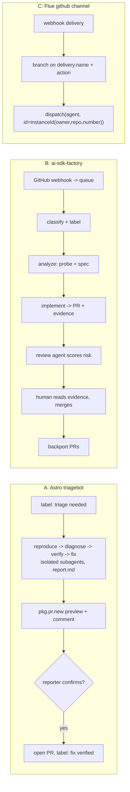

# Software factory prior art

Three primary sources, read in full on 2026-09-15. Every claim below is cited to the source that owns it.

- [A] Cloudflare/Astro: <https://blog.cloudflare.com/astro-issue-triage/> (Matthew Phillips, 2026-08-04)
- [B] Vercel/AI SDK: <https://vercel.com/blog/building-a-software-factory-for-ai-sdk> (Lars Grammel, Eric Dodds, 2026-08-12)
- [C] Flue `@flue/github` channel docs: <https://flueframework.com/docs/ecosystem/channels/github/> (updated 2026-07-21)

## How they compare

|                          | A: Astro                                                                                                                                  | B: Vercel                                                      | C: Flue channel                                                                                                  |
| ------------------------ | ----------------------------------------------------------------------------------------------------------------------------------------- | -------------------------------------------------------------- | ---------------------------------------------------------------------------------------------------------------- |
| Trigger                  | Label `triage needed` on issue, run in GitHub Actions                                                                                     | GitHub webhooks -> Vercel Queues -> workers start sandbox runs | Raw webhook; app branches on `delivery.name` / `payload.action`                                                  |
| State                    | Labels + re-reading issue comments; pipeline holds no state                                                                               | Factory DB (Neon Postgres) + monitoring UI                     | None; stateless, no dedup                                                                                        |
| Ready gate               | Reproduce first, then verify it is a real bug before fixing                                                                               | Classify, then analysis agent writes a failing probe + spec    | n/a                                                                                                              |
| Human gate               | Reporter confirms preview fix before PR is opened                                                                                         | Human on AI SDK team merges everything                         | n/a                                                                                                              |
| Review loop              | Not described past PR creation                                                                                                            | Separate review agent scores risk; human reads evidence chain  | n/a                                                                                                              |
| Auth / GitHub App vs PAT | Two workflow secrets, `read-token: ${{ secrets.GITHUB_TOKEN }}` and `write-token: ${{ secrets.BOT_GITHUB_TOKEN }}`; App-vs-PAT not stated | Not disclosed in the post                                      | `GITHUB_WEBHOOK_SECRET` (inbound) + `GITHUB_TOKEN` (outbound); App-vs-PAT is the app's choice, not the channel's |

## [A] Cloudflare / Astro triagebot

**Trigger.** "the whole pipeline was really just a state machine driven by issue labels. Every new submission starts with the label `triage needed`, and once a user confirms a fix it moves to `fix verified`. Beyond those label transitions the pipeline holds no state of its own; it simply reads back through the issue's existing comments to work out where a given issue is and what should happen next." Runs "inside GitHub Actions" via `withastro/triagebot-action@v1`.

**Readiness gate = the agent itself.** The triage skill mirrors manual steps: Reproduce (clone the repro repo) -> Diagnose (instrument, add logging) -> Verify ("determine if the behavior is genuinely a bug or intended functionality") -> Fix (convert repro into failing unit tests, fix via the architecture guide). Nothing is "ready" until reproduced and verified as a bug.

**Design decision: one isolated subagent per phase, handing off via `report.md`.** Reason: "To prevent the frequent LLM bias toward forcing a solution when a bug might not actually exist." Also the pipeline lives in GitHub for "complete transparency so that anyone could easily audit the agent's sequential reasoning."

**Human in the loop.** The pipeline "spins up a preview release with pkg.pr.new and posts everything back to the issue: a summary of what it found, the full logs, and instructions for installing the preview. The original reporter can then try the patch against their own project, and if they confirm it works, the automation opens a pull request linked to the issue." The reporter, not a maintainer, is the gate before a PR exists.

**Review loop.** Not described; the post ends at PR creation.

**Failures / warnings.**

- HMR bug: "The triage bot repeatedly attempted to modify a specific if condition ... While this change fixed the targeted bug, it introduced regressions elsewhere due to a lack of test coverage." Fixed by adding "a descriptive comment explaining the exact logic"; "the bot adapted and stopped attempting incorrect modifications in that area."
- Agent failure is treated as codebase signal, one of three: "Opaque Abstractions", "Missing Documentation", "Insufficient Testing". "Every time we chase down one of these failures and add the missing comment, test, or clearer boundary, the bot gets noticeably better ... and so does the next human."
- Coupling trap: triage logic "lived directly within the Astro monorepo. This coupling made iteration difficult; upgrading Flue or modifying the workflow felt like performing surgery on live infrastructure without a safety net." Fix: standalone, tested `triagebot-action` repo.
- Auth is split by privilege, not documented as App-vs-PAT: the Action config passes `read-token: ${{ secrets.GITHUB_TOKEN }}` and `write-token: ${{ secrets.BOT_GITHUB_TOKEN }}` as two separate secrets — the token that reads the repo is not the one that can comment or open PRs. Whether either is a GitHub App installation token or a classic PAT is not stated in the post.
- Feared bot responses would "feel impersonal"; "That did not happen. If anything, we talk to users more now, just in more useful places" (Discord, RFCs).
- Did not "auto-close cold tickets".

**Result.** Open issues "from over 200 to about 30", expecting zero.

**Other decisions.** Started as a local agent skill run on maintainers' machines, then reused unchanged in the Action. Models set per role (`triage-model`, `verification-model`). Generalised into Flue because "Reacting to an event, running a sequence of isolated subagents, and separating their reasoning from the actions they're allowed to take — it's all just a workflow."

## [B] Vercel / ai-sdk-factory

**Trigger.** "GitHub webhooks feed the issue queue, and as soon as they arrive workers automatically pull them and kick off agent runs in sandboxes." Stack: Vercel Functions (API, workers, webhook ingress), Vercel Queues, Vercel Blob (logs), Vercel Sandbox, Neon Postgres. A "monitoring UI ... tracks every run in parallel, and visualizes the queue for the team of reviewers."

**Readiness gate.** Two agents before any code is written:

1. Classifier "classifies issues and pull requests" as bug / feature / docs, "applied a label", and posts its rationale as a comment.
2. Analysis agent: "Agents in the factory don't make any assumptions about the technical validity of a feature request or bug", so it "wrote a probe" that failed on `main` as evidence, then wrote a spec, confirmed architecture fit and backward compatibility, and scoped docs changes.

**Human in the loop.** "a human needs to have control over what ships. We needed our factory to heavily automate the lifecycle around the human, without removing them." "The last line of defense is human review: nothing is merged without approval from a human on the AI SDK team." Review depth scales with risk: "Docs fixes get a quick glance ... well-defined provider changes get focused validation ... A new public API gets deep review." Enabled by "a full chain of documented evidence".

**Review loop.** Implementation agent opens the PR with a live end-to-end test "included as additional evidence". A separate "review agent scored the change" (side-effect / performance / backwards-compat risk) and approved. Then "Lars read the chain of evidence from the agents, reviewed the code changes, and merged." Post-merge, backport agent opened PRs; on a conflict it "labeled and committed the conflicted state, identified and validated a fix, and pushed it seventeen minutes later."

**Design decisions with reasons.**

- One agent per task, "with its own prompts, context, and evals." Rejected one agent with many skills: "higher maintenance and troubleshooting burden over time."
- Security from agent two, "because bug reproduction was the first step where the factory executed code based on content it didn't control." "every issue, pull request, comment, and the links inside them are untrusted." Each agent runs in "an isolated Vercel Sandbox containing its code, its runtime, and only the secrets the agent's specific task needs", plus "a shielding layer around the sandbox that controls what agents can reach over the network."
- Local CLI first, cloud later: "iterate quickly as we noticed inaccuracies, felt friction"; moved "once multiple steps were running reliably."
- Incremental: "starting at the beginning of the process with classification" which "passed helpful context to the other specialized agents we built later."
- Reviewer efficiency as first principle: existing bots "still route every change through one human's attention."

**Failure taxonomy.** "Every run ends one of four ways: success, flawed, blocked, or manual. Only success ships." Flawed -> "better prompts, better context, or a new eval case". Blocked -> environment missing "a credential, a service, or a dependency" -> provision it. Manual -> "a boundary we drew on purpose". "improving the factory will become the standard engineering job."

**Result.** 25-35% of weekly merged PRs; >50% of v6 merges; >75% of July closed issues; open issues 1,022 -> 844.

## [C] Flue `@flue/github` channel

**Trigger.** `createGitHubChannel({ webhookSecret, webhook({ delivery }) })`, mounted via `app.route('/channels/github', github.route())`; webhook URL `/channels/github/webhook`. "Every verified non-ping delivery is forwarded with its native `@octokit/webhooks-types` payload." "There is no fixed list of supported events and no normalization layer." "Choosing which events to act on is application policy — subscribe to them in GitHub and branch on `delivery.name` (and, where it matters, `delivery.payload.action`)." So a label workflow is `issues` / `pull_request` events with `action === 'labeled'` and a check on `payload.label.name`, written by us.

**Dispatch.** `dispatch(Agent, { id: channel.instanceId(issueRef), initialData, message: { kind: 'signal', type, body, attributes } })`. One agent instance per `{owner, repo, issueNumber}`; "Pull requests use their issue number for issue comments." `initialData` is "recorded once when the event creates the instance and ignored afterward." Review-comment threads map via `threadId: comment.in_reply_to_id ?? comment.id`.

**Posting back.** Example tool is `commentOnIssue` over a project-owned `Octokit` client. "The model selects the comment body; trusted code binds the repository and issue." Labels, reviews, checks: not provided; write your own Octokit tools.

**Auth.** `GITHUB_WEBHOOK_SECRET` (verify inbound) and `GITHUB_TOKEN` (outbound). Content type must be `application/json`. "subscribe to the minimum event set the application handles."

**Warnings.**

- "GitHub expects a `2xx` response within ten seconds and does not auto-retry. The package does not enforce a handler deadline; ... admit durable work quickly rather than blocking the response on it."
- "The channel is stateless and does not deduplicate delivery ids, so claim `delivery.deliveryId` in application storage before dispatch when duplicate admission matters. Failed deliveries can be inspected and manually redelivered from GitHub with the same delivery id."

## Implications for Vishwakarma

Traps are marked **don't**.

**Labels and triggers**

- Labels as the state machine, comments as the log, no hidden state [A]. Our `agent:*` labels fit; add the terminal / intermediate labels too (A uses `triage needed` -> `fix verified`).
- Flue gives raw `delivery`; label filtering is ours [C]. Subscribe only to `issues`, `pull_request`, `issue_comment`, `pull_request_review_comment` [C].
- **Don't** do work inside the webhook handler: 10 s deadline, no GitHub retry [C]. Enqueue, return 2xx, run in a sandbox worker [B, C].
- **Don't** trust delivery uniqueness: claim `deliveryId` before dispatch or a redelivery double-runs an agent [C].
- **Don't** keep the agent workflow inside the target repo; version it separately with its own tests [A].

**Issue readiness**

- Readiness is proven, not declared: reproduce / probe on `main` fails, then verify it is really a bug [A, B]. Gate `agent:implement` on a prior analysis output (repro or failing probe + spec).
- Classify first, alone; it feeds context to every later agent [B].
- **Don't** let one agent reproduce and fix in the same context: "LLM bias toward forcing a solution when a bug might not actually exist" [A]. Isolate phases, hand off via a written report.

**Humans in the loop**

- A human merges everything [B]. Design for reviewer efficiency: each PR carries an evidence chain (probe, tests, live check, risk scores) so review depth can scale with risk [B].
- Let the reporter verify a preview before a PR exists [A]; cheaper than a maintainer review and keeps users engaged.
- **Don't** auto-close cold issues [A].

**Review loop**

- Reviewer is a separate agent from the implementer, and scores risk rather than only approving [B]. Matches our rounds.
- Record run outcome as `success | flawed | blocked | manual`; only success ships; the rest are backlog for prompts/evals, environment, or a boundary decision [B].
- **Don't** treat a repeated agent failure as an agent bug first; it usually marks an opaque abstraction, missing comment, or missing test in the codebase [A]. The Astro HMR regression came from the fix agent editing an untested branch.

**Architecture**

- One agent per task with its own prompt, context and evals [B]; one instance per issue/PR number [C].
- Sandbox per run with only that task's secrets and egress control from the first agent that runs untrusted code [B].
- Build the pipeline locally as a CLI/skill first, then host it [A, B].
- **Don't** infer an auth model from these sources. Only [A] shows a shape worth copying — a read-scoped token and a separate write-scoped token as two secrets — and even it doesn't say whether either is a GitHub App installation token or a classic PAT; [B] doesn't disclose its GitHub auth at all. Pick Vishwakarma's model deliberately (a GitHub App installation token, scoped per repo, is the least-privilege default) rather than assuming one of these did it a particular way.

**Gaps in the public record**

- None of the three sources report LLM/GitHub API rate limits, run cost, agents looping or getting stuck, or noisy/spammy PR volume as problems, even though these are exactly the failure modes a label-triggered fleet tends to hit. Silence here is not evidence of absence — [B]'s "flawed" outcome bucket and "shielding layer around the sandbox" controlling network egress are the closest hints that these problems exist and are being managed, just not narrated. Vishwakarma should instrument for cost, rate limits, and loop/retry counts from day one instead of assuming they won't matter because the case studies don't mention them.
